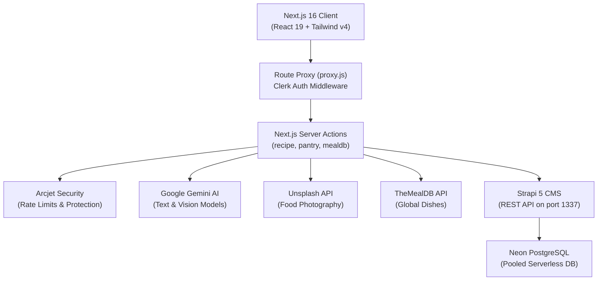

# 🍳 SmartChef (Servd) — AI Cooking Assistant & Smart Pantry

<p align="center">
  
</p>

<p align="center">
  <strong>Turn your fridge leftovers into culinary masterpieces with AI-driven recipe generation, intelligent pantry tracking, and smart nutrition insights.</strong>
</p>

<p align="center">
  <a href="https://nextjs.org"></a>
  <a href="https://react.dev"></a>
  <a href="https://strapi.io"></a>
  <a href="https://tailwindcss.com"></a>
  <a href="https://neon.tech"></a>
  <a href="https://ai.google.dev"></a>
  <a href="https://clerk.com"></a>
  <a href="https://arcjet.com"></a>
</p>

---

## 📑 Table of Contents

- [Overview](#-overview)
- [Key Features](#-key-features)
- [System Architecture](#-system-architecture)
- [Tech Stack](#-tech-stack)
- [Monorepo Directory Structure](#-monorepo-directory-structure)
- [Database & Content Modeling](#-database--content-modeling)
- [Getting Started & Installation](#-getting-started--installation)
- [Available Scripts](#-available-scripts)
- [API & Server Actions Reference](#-api--server-actions-reference)
- [Security & Rate Limiting](#-security--rate-limiting)
- [Troubleshooting & Gotchas](#-troubleshooting--gotchas)
- [Deployment Guide](#-deployment-guide)
- [Contributing & License](#-contributing--license)

---

## 📖 Overview

**SmartChef** is a full-stack, production-ready web application built to eliminate food waste and elevate home cooking. Using modern multimodality via **Google Gemini Vision**, users can snap a photo of their refrigerator or pantry, automatically identify ingredients, and get tailored recipes that maximize existing supplies.

The project pairs a reactive **Next.js 16** front end (utilizing Turbopack, React 19, and Tailwind CSS v4) with a robust **Strapi 5** headless CMS back end running on top of **Neon Serverless PostgreSQL**.

---

## 🌟 Key Features

### 📸 1. AI Fridge & Pantry Scanner
- Upload or drag-and-drop photos of ingredients, open fridges, or pantry shelves.
- Analyzed via **Gemini 2.5 Flash Vision** to extract detected item names, quantities, and confidence levels.
- One-click bulk save to the user's persistent pantry inventory.

### 🧑‍🍳 2. Dynamic AI Recipe Generator
- Generates bespoke recipes matching whatever is in your pantry.
- Detailed step-by-step cooking instructions with estimated prep/cook times, difficulty, and serving sizes.
- Full macro- and micro-nutrient profiles (calories, protein, carbs, fats, vitamins).
- Ingredient substitute engine suggests alternatives when you're missing an item.
- Automatic food imagery supplied dynamically via the **Unsplash API**.

### 📄 3. Printable PDF Export
- Generates clean, publication-ready PDF recipe cards directly on the client using `@react-pdf/renderer`.
- Download, share, or print recipes without page clutter.

### 🌍 4. Worldwide Recipe Explorer (TheMealDB)
- Integrated with **TheMealDB** API to browse thousands of authentic global dishes.
- Filter by categories (*Breakfast, Seafood, Vegetarian, Desserts...*) or world cuisines (*Italian, Japanese, Indian, Mexican...*).
- Daily rotating featured dish on the Dashboard (*"Recipe of the Day"*).

### 🔐 5. Clerk Auth & Subscription Tiers
- Authentication managed through **Clerk Core 3** with custom proxy routing.
- Synchronized profile state with Strapi (`clerkId`, `subscriptionTier`).
- Tiered feature gating:
  - **Sous Chef (Free)**: 10 pantry scans/month, 5 AI meal recommendations/month.
  - **Head Chef (Pro - $7.99/mo)**: Unlimited scans, unlimited AI recipes, nutritional analysis, chef tips, and priority access.

### 🛡️ 6. Enterprise-Grade Rate Limiting & Protection
- Token-bucket rate limiting implemented via **Arcjet** based on the authenticated user's active tier.
- Bot detection and abuse prevention protecting sensitive AI generation server actions.

---

## 🏗️ System Architecture



---

## 🛠️ Tech Stack

### **Frontend (`/frontend`)**
| Layer | Technology | Description |
| :--- | :--- | :--- |
| **Framework** | [Next.js 16.3.3](https://nextjs.org/) | App Router with Turbopack bundler |
| **Library** | [React 19.2.8](https://react.dev/) | React Server Components (RSC) & Server Actions |
| **Styling** | [Tailwind CSS v4](https://tailwindcss.com/) | Modern CSS-first engine with `@theme` directives |
| **Components** | Radix UI Primitive & Base UI | Accessible dialogs, tabs, badges, and modals |
| **Icons** | [Lucide React](https://lucide.dev/) | High-quality feather icons |
| **Authentication** | [@clerk/nextjs](https://clerk.com/) | Clerk Core 3 (`<Show>` conditional components) |
| **Artificial Intelligence** | [@google/generative-ai](https://www.npmjs.com/package/@google/generative-ai) | Google Gemini 2.5 Flash Vision & Text |
| **Rate Limiting** | [@arcjet/next](https://arcjet.com/) | Token-bucket quotas & bot defense |
| **PDF Generation** | [@react-pdf/renderer](https://react-pdf.org/) | In-browser PDF generation engine |
| **Toasts** | [Sonner](https://sonner.emilkowal.ski/) | Opinionated toast notifications |

### **Backend (`/backend`)**
| Layer | Technology | Description |
| :--- | :--- | :--- |
| **CMS** | [Strapi 5.52.2](https://strapi.io/) | Headless Node.js content management system |
| **Database** | [Neon PostgreSQL](https://neon.tech/) | Serverless PostgreSQL with SSL connection pooling |
| **Database Client** | `pg` 8.20.0 | Native Postgres driver |
| **Admin Panel** | Strapi Vite Admin | Visual CMS management interface at `/admin` |

---

## 📂 Monorepo Directory Structure

```
SmartChef/
├── package.json                 # Monorepo root configuration & concurrent runner
├── package-lock.json
├── README.md                    # Project documentation
├── .gitignore                   # Multi-tier git exclusion rules
│
├── frontend/                    # Next.js 16 Web Application
│   ├── next.config.mjs          # Next.js config (remote image patterns)
│   ├── proxy.js                 # Next 16 route proxy & Clerk auth matcher
│   ├── actions/                 # Next.js Server Actions
│   │   ├── mealdb.actions.js    # TheMealDB queries (daily, category, cuisine)
│   │   ├── pantry.actions.js    # Gemini vision scan & pantry CRUD
│   │   └── recipe.actions.js    # Gemini recipe generation, bookmarking
│   ├── app/                     # App Router pages & layouts
│   │   ├── layout.js            # Root layout with ClerkProvider & Header
│   │   ├── page.js              # Landing page (hero, stats, features, pricing)
│   │   ├── (auth)/              # Sign-in & Sign-up routes
│   │   └── (main)/              # Protected application workspace
│   │       ├── dashboard/       # Daily dish, categories, world cuisines
│   │       ├── pantry/          # Interactive pantry inventory & scanner
│   │       ├── recipe/          # Detailed recipe view with AI generator
│   │       └── recipes/         # Saved collection & category/cuisine filters
│   ├── components/              # Shared UI components & Modals
│   │   ├── AddToPantryModal.jsx # Scan/manual entry modal
│   │   ├── Header.jsx           # Global sticky navbar with Clerk auth
│   │   ├── HowToCookModal.jsx   # Quick recipe search dialog
│   │   ├── ImageUploader.jsx    # Drag-and-drop file upload
│   │   ├── PricingModal.jsx     # Subscription modal trigger
│   │   ├── PricingSection.jsx   # Free vs Pro plan pricing cards
│   │   ├── RecipeCard.jsx       # Universal recipe visual card
│   │   ├── RecipeGrid.jsx       # Category/cuisine meal list grid
│   │   ├── RecipePDF.jsx        # PDF document layout
│   │   └── ui/                  # Design system primitives (Button, Card, Dialog...)
│   ├── hooks/                   # Custom hooks
│   │   └── use-fetch.js         # Standardized async action hook with useCallback
│   ├── lib/                     # Utilities & configuration
│   │   ├── arcjet.js            # Arcjet rate-limiting clients
│   │   ├── checkUser.js         # Clerk user sync with Strapi
│   │   ├── data.js              # Static datasets (stats, features, emojis)
│   │   └── utils.js             # CSS class merging (cn)
│   └── public/                  # Assets (logos, hero illustrations)
│
└── backend/                     # Strapi 5 Headless CMS
    ├── config/                  # Strapi settings
    │   ├── database.js          # Neon PostgreSQL connection & SSL configuration
    │   ├── server.js            # Port (1337) and host settings
    │   └── plugins.js           # Plugin activations
    ├── src/
    │   ├── index.js             # Strapi lifecycle bootstrap
    │   ├── extensions/          # Plugin overrides
    │   │   └── users-permissions/
    │   │       └── content-types/user/schema.json # Extended User schema
    │   └── api/                 # Content-Type definitions & controllers
    │       ├── pantry-item/     # Pantry item schema & relations
    │       ├── receipe/         # Recipe schema (instructions, nutrition)
    │       └── saved-receipe/   # Saved bookmark relation schema
    └── types/                   # Generated TypeScript definitions
```

---

## 🗄️ Database & Content Modeling

Strapi manages 4 core models stored inside **Neon PostgreSQL**:

### **1. User (`plugin::users-permissions.user`)**
Extended with custom attributes:
- `clerkId` (*string, unique*): Maps to Clerk's user ID.
- `firstName` (*string*): User first name.
- `lastName` (*string*): User last name.
- `imageUrl` (*string*): Avatar URL.
- `subscriptionTier` (*enumeration: `free` | `pro`*): User plan status.

### **2. Receipe (`api::receipe.receipe`)**
Stores AI-generated and custom recipes:
- `title` (*string, required*): Recipe name.
- `description` (*text*): Summary overview.
- `cuisine` (*enumeration*): World cuisine type.
- `category` (*enumeration*): Breakfast, Lunch, Dinner, Snack, Dessert.
- `ingredients` (*json*): Array of measured ingredients.
- `instructions` (*json*): Step-by-step cooking steps.
- `prepTime` / `cookTime` / `servings` (*integer*).
- `nutrition` (*json*): Calories, protein, carbs, fats.
- `tips` / `substitutions` (*json*): Pro tips & substitutions.
- `imageUrl` (*string*): High-res photo URL.
- `author` (*manyToOne* &rarr; `User`).

### **3. Pantry Item (`api::pantry-item.pantry-item`)**
Tracks ingredients currently in the user's kitchen:
- `name` (*string, required*): Ingredient name.
- `quantity` (*string*): Measured amount (e.g., "2 cups", "500g").
- `imageUrl` (*string*): Optional photo.
- `owner` (*manyToOne* &rarr; `User`).

### **4. Saved Receipe (`api::saved-receipe.saved-receipe`)**
Bookmark join entity:
- `SaveAt` (*datetime*): When the user bookmarked the recipe.
- `user` (*manyToOne* &rarr; `User`).
- `receipe` (*manyToOne* &rarr; `Receipe`).

---

## 🚀 Getting Started & Installation

### **Prerequisites**
- **Node.js**: `v20.0.0` or higher (verified on `v22.x`)
- **npm**: `v10.0.0` or higher
- A **Neon PostgreSQL** database account
- A **Clerk** application account
- A **Google AI Studio** Gemini API Key

### **1. Clone & Install**

```bash
# Clone the repository
git clone https://github.com/nabanitabera1052012/SmartChef.git
cd SmartChef

# Install all dependencies across monorepo in one command
npm run install:all
```

### **2. Setup Environment Variables**
Configure your local environment variables for both `frontend` and `backend` with your own credentials (Clerk, Neon PostgreSQL, Gemini API, and Strapi tokens).

### **3. Run Both Servers Concurrently**


```bash
# From the project root:
npm run dev
```

This starts:
- 🌐 **Frontend (Next.js)** at [http://localhost:3000](http://localhost:3000)
- ⚙️ **Backend (Strapi)** at [http://localhost:1337](http://localhost:1337)
- 🎛️ **Strapi Admin Panel** at [http://localhost:1337/admin](http://localhost:1337/admin)

---

## 📜 Available Scripts

Run these scripts from the repository root:

| Command | Action |
| :--- | :--- |
| `npm run dev` | Starts **both** Strapi and Next.js concurrently using `concurrently` |
| `npm run dev:frontend` | Starts only the Next.js development server on port 3000 |
| `npm run dev:backend` | Starts only the Strapi development server on port 1337 |
| `npm run build` | Builds both the Strapi admin panel and Next.js production bundle |
| `npm run lint` | Runs ESLint across the Next.js code with zero warnings |
| `npm run install:all` | Installs dependencies in the root, backend, and frontend |

---

## 📡 API & Server Actions Reference

### **Next.js Server Actions**

#### `pantry.actions.js`
- `scanPantryImage(formData)`: Uploads image to Gemini 2.5 Flash Vision, validates against Arcjet tier scan limits, and returns detected ingredients list.
- `saveScannedIngredients(formData)`: Bulk saves scanned items linked to the authenticated user.
- `addPantryItemManually(formData)`: Adds single item with name and quantity.
- `getPantryItems()`: Retrieves all pantry items owned by the authenticated user.
- `updatePantryItem(formData)`: Updates name/quantity for an existing pantry item.
- `deletePantryItem(formData)`: Removes item from user inventory.

#### `recipe.actions.js`
- `getOrGenerateRecipe(formData)`: Checks if recipe exists in database; if not, calls Gemini to craft detailed instructions, macros, and substitutes, fetches image from Unsplash, and saves to database.
- `saveRecipeToCollection(formData)`: Bookmarks a recipe into the user's personal cookbook.
- `removeRecipeFromCollection(formData)`: Removes bookmark.
- `getSavedRecipes()`: Retrieves all recipes bookmarked by the user.

#### `mealdb.actions.js`
- `getRecipeOfTheDay()`: Fetches cached featured daily recipe.
- `getCategories()`: Fetches all meal categories (*Chicken, Beef, Dessert...*).
- `getAreas()`: Fetches all global culinary areas (*Italian, Indian, Japanese...*).
- `getMealsByCategory(category)`: Lists all meals matching a category.
- `getMealsByArea(area)`: Lists all meals matching a cuisine region.

---

## 🛡️ Security & Rate Limiting

Rate limiting is orchestrated via **Arcjet** in [frontend/lib/arcjet.js](frontend/lib/arcjet.js):

- **Free Tier (`freePantryScans`)**:
  - Token Bucket: Max 10 tokens / 30-day interval.
  - Refill rate: 10 tokens per month.
- **Free Tier (`freeMealRecommendations`)**:
  - Token Bucket: Max 5 tokens / 30-day interval.
- **Pro Tier (`proTierLimit`)**:
  - Capacity: 1000 tokens / 30-day interval.
- **Bot Protection**: Automated bot detection enabled across AI routes to prevent credential abuse and token exhaustion.

---

## 💡 Troubleshooting & Gotchas

### 1. Clerk Core 3 Breaking Change
> In `@clerk/nextjs` Core 3, `<SignedIn>` and `<SignedOut>` have been deprecated and throw exceptions.
> **Fix**: Use `<Show when="signed-in">` and `<Show when="signed-out">` imported from `@clerk/nextjs`.

### 2. Next.js 16 Route Matcher & Proxy
> Next.js 16 uses `proxy.js` at the frontend root rather than legacy `middleware.js`. Ensure `NextResponse` is imported:
> `import { NextResponse } from 'next/server';`

### 3. Strapi Schema Relational Fields
> Ensure relations in `schema.json` explicitly point to `plugin::users-permissions.user` for user references (e.g., `owner`, `author`, `user`), and never to self-referential entity IDs.

### 4. Neon Database SSL on Windows
> When connecting to Neon from local Node environments, configure `DATABASE_SSL=true` and `DATABASE_SSL_REJECT_UNAUTHORIZED=false` in `backend/.env` to avoid self-signed certificate rejection.

### 5. Disabling Email Verification (Instant Sign-Up)
> By default, Strapi users are automatically marked as `confirmed: true` by SmartChef's `checkUser.js`.
> To skip or disable email OTP verification during user sign-up in **Clerk**:
> 1. Go to your **[Clerk Dashboard](https://dashboard.clerk.com)** &rarr; **User & Authentication** &rarr; **Email, Phone, Username**.
> 2. Click the gear icon next to **Email Address**.
> 3. Turn off **"Verify at sign-up"** (or enable Social Login like Google/GitHub for 1-click verification-free login).
> 4. In development mode, you can also use test emails with bypass code `424242`.

---

## 🚢 Deployment Guide

### **Deploying the Frontend (Vercel)**
1. Import the repository on [Vercel](https://vercel.com).
2. Set **Root Directory** to `frontend`.
3. Add all variables from `frontend/.env.example` in Vercel's Environment Variables settings.
4. Set build command to `next build`.
5. Deploy.

### **Deploying the Backend (Strapi Cloud / Render / Railway)**
1. Create a Web Service on [Render](https://render.com) or [Railway](https://railway.app).
2. Set **Root Directory** to `backend`.
3. Build Command: `npm install && npm run build`
4. Start Command: `npm run start`
5. Supply database credentials from your **Neon PostgreSQL** dashboard.

---

## 🤝 Contributing & License

1. Fork the Project: `git checkout -b feature/AmazingFeature`
2. Commit your Changes: `git commit -m 'feat: add AmazingFeature'`
3. Push to the Branch: `git push origin feature/AmazingFeature`
4. Open a Pull Request

Distributed under the MIT License. Created with 💗 by [Nabanita Bera](https://github.com/nabanitabera1052012).
